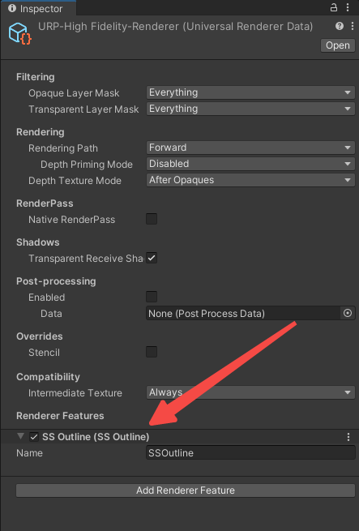

> [!notice] 本描边特点：
>
> - 描边只出现在模型的视觉边缘，当有物体遮挡时描边会贴合遮挡物。
> - 描边宽度不会受到模型的距离远近或模型大小影响。
> - 不需要修改物体的材质即可添加描边。
> - 其实这个效果和 Unity 编辑器中选中模型时的轮廓效果相同

相信各位在搜索 3D 描边教程的时候都搜到了法线外扩描边法，不过法线外扩描边通常是用在风格化渲染上，用来模拟手绘风格，而不是为了在游戏中突出目标。

但是好烦啊，我想要这种外轮廓描边的效果，怎也没搜不到完整的教程😤，最终找到了一个[类似效果的 Git 仓库](https://github.com/Robinseibold/Unity-URP-Outlines/tree/main)，经过照抄+学习后终于做出来了我想要的，因此，决定在这里记录下我探索屏幕空间外描边的结果。

> 本人是在 Unity 2022.3 和 Urp 14 中实现的，其他版本具体步骤可能不太一样。

## 原理介绍

这种描边的原理比较好理解：

1. 将需要被描边的物体用纯白色绘制在一张黑色图片上

2. 对这张黑白纹理计算描边

3. 将描边结果转换成某种颜色，最终叠加到我们的屏幕上


## 实现步骤一：纯白色绘制

因为我们需要一个额外的黑白纹理，简单的后处理shader无法满足要求，因此需要借助 `ScriptableRendererFeature`。

继承 `ScriptableRendererFeature` 类即可实现自定义的 RendererFeature，一个 RendererFeature 可以包含多个 RenderPass，我们在 RenderPass 内编写自定义的渲染逻辑。

首先创建 RendererFeature，在项目任意位置新建脚本并在脚本中实现 `ScriptableRendererFeature` 的子类即可，此处我起名为 `SSOutline`:

```csharp
using UnityEngine.Rendering.Universal;

public class SSOutline: ScriptableRendererFeature
{
    public override void Create()
    { }

    public override void AddRenderPasses(ScriptableRenderer renderer, ref RenderingData renderingData)
    { }
}
```

随后回到 Unity，我们就能在 `Universal Renderer Data` 上添加 `SSOutline` 了：



当然由于还没写代码，添加之后要么黑屏要么没反应，可以先删掉，代码写完再加上。

### 创建 RenderPass

实际的渲染逻辑是写在 RenderPass 里面的，RendererFeature 只是 RenderPass 的管理者

直接修改 `SSOutline` 的代码：

```csharp
using UnityEngine.Rendering;
using UnityEngine.Rendering.Universal;

public class SSOutline : ScriptableRendererFeature
{
    private Pass pass;

    // 在这个 Create 方法中进行初始化工作，现在在这里创建 RenderPass
    public override void Create()
    {
        pass = new Pass();
        // 下面这句必须要有
        pass.renderPassEvent = RenderPassEvent.AfterRenderingSkybox;
    }

    // 在这个方法中向渲染管线添加自定义 RenderPass
    public override void AddRenderPasses(ScriptableRenderer renderer, ref RenderingData renderingData)
    {
        renderer.EnqueuePass(pass);
    }

    // 用于绘制黑白底色的 Pass，暂时还不写逻辑
    private class Pass : ScriptableRenderPass
    {
        public override void Execute(ScriptableRenderContext context, ref RenderingData renderingData)
        { }
    }
}
```

`ScriptableRendererFeature` 的框架基本上都长这个样子，下面的代码就不在张贴完整代码了。

> [!tip] 需要关注的重点
>
> Create 方法中有一句 `pass.renderPassEvent = RenderPassEvent.AfterRenderingSkybox;`，这个东西是必须要有的，这指定了 RenderPass 的渲染时机，我们需要在绘制完天空盒后再绘制纯白图片。

### 创建那张黑白纹理

在 Pass 中定义一个 `RTHandle` 并重写 `OnCameraSetup` 方法：

```csharp
// 存放这张黑白纹理，RTHandle 可以理解成封装过的 RenderTexture
private RTHandle objectTexture;

// 这个方法会在 Pass 准备渲染到某个相机上时调用，我们在这里配置渲染所需要的数据。
public override void OnCameraSetup(CommandBuffer cmd, ref RenderingData renderingData)
{
    // 获取摄像机的分辨率、颜色格式等属性，用来创建黑白纹理用。
    var desc = renderingData.cameraData.cameraTargetDescriptor;
    // 黑白纹理不需要记录深度信息
    desc.depthBufferBits = 0;
    // 创建黑白纹理的 RTHandle
    RenderingUtils.ReAllocateIfNeeded(ref objectTexture, desc);
}
```

### 绘制这张黑白纹理

首先准备一个把模型渲染成纯白色的 Shader，逻辑非常简单，新建一个 Unlit 的 ShaderGreaph，我起名为 `WhiteObjectShader`：


前往 `Pass` 类中创建对应的材质球：

```csharp
private readonly Material whiteObjectMaterial = new(Shader.Find("Shader Graphs/WhiteObjectShader"));
```

接下来准备绘制这张图了，修改 `Execute` 方法：

```csharp

```